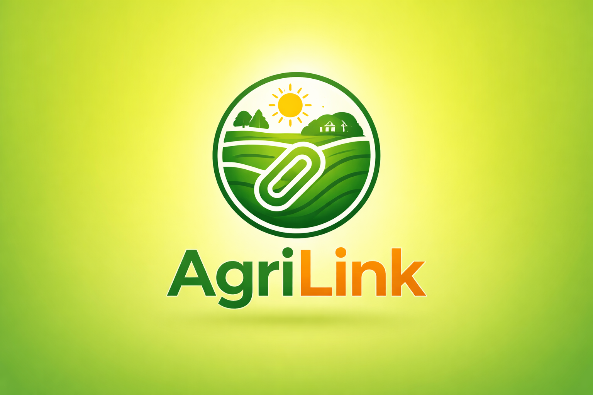

<div align="center">
  
  
  # 🌾 Agrilink Mobile
  
  ### Empowering Farmers Through Technology
  
  **A comprehensive Flutter-based agricultural management platform connecting farmers with resources, markets, and services.**

  [](https://flutter.dev)
  [](https://dart.dev)
  [](LICENSE)
  [](https://firebase.google.com)

  [Features](#-features) • [Screenshots](#-screenshots) • [Installation](#-getting-started) • [Tech Stack](#-tech-stack) • [Contributing](#-contributing)

</div>

---

## 📋 Table of Contents

- [About](#-about)
- [Features](#-features)
- [Screenshots](#-screenshots)
- [Tech Stack](#-tech-stack)
- [Project Structure](#-project-structure)
- [Getting Started](#-getting-started)
- [Configuration](#-configuration)
- [Running the App](#-running-the-app)
- [Testing](#-testing)
- [Contributing](#-contributing)
- [License](#-license)
- [Contact](#-contact)

---

## 🌱 About

Agrilink Mobile is a cutting-edge agricultural platform designed to bridge the gap between farmers and modern agricultural practices. Built with Flutter, this application provides farmers with essential tools for farm management, market access, real-time communication, and data-driven decision making.

### 🎯 Mission
To empower smallholder and commercial farmers with technology-driven solutions that enhance productivity, market access, and sustainable farming practices.

---

## ✨ Features

### 🚜 Core Functionality
- **🌾 Crop & Farm Management** - Track crops, planting schedules, and harvest cycles
- **📊 Market Price Updates** - Real-time agricultural commodity prices
- **🌤️ Weather Notifications** - Location-based weather forecasts and alerts
- **💡 Smart Recommendations** - AI-powered suggestions for resources and services

### 🛒 Marketplace
- **🛍️ Product Catalog** - Browse and purchase agricultural products
- **🛒 Shopping Cart** - Seamless ordering experience
- **📦 Order Management** - Track orders from placement to delivery
- **🏷️ Category Browsing** - Easy navigation through product categories

### 👥 Social & Communication
- **💬 Real-time Chat** - Connect with other farmers and agricultural experts
- **👤 User Profiles** - Personalized farmer profiles
- **🔔 Notifications** - Stay updated with important alerts

### 🔐 Authentication & Security
- **📧 Email/Password Authentication** - Secure account creation
- **🔐 Google Sign-In** - Quick and secure login
- **📱 SMS Verification** - Phone number verification with autofill

### 📍 Advanced Features
- **📍 Location Services** - GPS-based farm mapping and location tracking
- **🎨 Multi-language Support** - Localized content for different regions
- **🌐 Offline Support** - Access critical features without internet
- **📸 Image Upload** - Document crops, issues, and farm activities

---

## 📱 Screenshots

<div align="center">
  
  
  
</div>

> 📸 *Screenshots coming soon*

---

## 🛠️ Tech Stack

### Frontend Framework
- **Flutter** - Cross-platform UI framework
- **Dart** - Programming language

### State Management
- **BLoC** (flutter_bloc) - Predictable state management
- **Equatable** - Value equality

### Architecture
- **Clean Architecture** - Separation of concerns
- **Feature-based Structure** - Modular organization
- **Repository Pattern** - Data layer abstraction
- **Dependency Injection** (GetIt) - Loose coupling

### Networking & APIs
- **Dio** - HTTP client for REST APIs
- **Socket.IO** - Real-time bidirectional communication

### Backend Services
- **Firebase Core** - Backend infrastructure
- **Firebase Authentication** - User authentication
- **Google Sign-In** - OAuth integration

### Local Storage
- **SharedPreferences** - Key-value storage
- **Path Provider** - File system paths

### Navigation
- **GoRouter** - Declarative routing

### Utilities
- **Dartz** - Functional programming (Either, Option)
- **Logger** - Advanced logging
- **Geolocator** - Location services
- **Image Picker** - Media selection
- **Cached Network Image** - Image caching
- **WebView Flutter** - In-app web content

### Development Tools
- **Mockito & Mocktail** - Mocking frameworks
- **BLoC Test** - BLoC testing utilities
- **Flutter Lints** - Code quality rules

---

## 📁 Project Structure

```
lib/
├── ios/                    # iOS-specific configuration
├── lib/
│   ├── core/              # Core utilities, constants, and shared code
│   └── features/          # Feature modules
│       ├── auth/          # Authentication (login, signup, verification)
│       ├── cart/          # Shopping cart functionality
│       ├── category/      # Product categories
│       ├── chat/          # Real-time messaging
│       ├── domain/        # Shared domain entities
│       ├── home/          # Home screen and dashboard
│       ├── my_product/    # User's product listings
│       ├── order/         # Order management
│       ├── product/       # Product catalog
│       ├── profile/       # User profiles
│       ├── recommendation/# Smart recommendations
│       ├── registration/  # User registration
│       ├── role_request/  # Role-based access
│       └── SplashScreen/  # App initialization
├── assets/                # Images, fonts, and static resources
├── test/                  # Unit and widget tests
└── integration_test/      # Integration tests
```

---

## 🚀 Getting Started

### Prerequisites

Ensure you have the following installed:

- **Flutter SDK** (>=3.9.2)
- **Dart SDK** (>=3.9.2)
- **Android Studio** / **Xcode** (for mobile development)
- **Git**
- **Firebase CLI** (for Firebase integration)

### Installation

1. **Clone the repository**
   ```bash
   git clone https://github.com/Gemeda4927/Agrilink-mobile.git
   cd Agrilink-mobile
   ```

2. **Install dependencies**
   ```bash
   flutter pub get
   ```

3. **Generate code** (if needed)
   ```bash
   flutter pub run build_runner build --delete-conflicting-outputs
   ```

4. **Verify installation**
   ```bash
   flutter doctor
   ```

---

## ⚙️ Configuration

### Firebase Setup

1. **Create a Firebase project** at [Firebase Console](https://console.firebase.google.com)

2. **Add Android App**
   - Download `google-services.json`
   - Place it in `android/app/`

3. **Add iOS App**
   - Download `GoogleService-Info.plist`
   - Place it in `ios/Runner/`

4. **Enable Authentication Methods**
   - Email/Password
   - Google Sign-In

5. **Configure Firebase in your app**
   ```dart
   // Ensure Firebase is initialized in main.dart
   await Firebase.initializeApp();
   ```

### Environment Variables

Create a `.env` file in the root directory (if applicable):

```env
API_BASE_URL=https://your-api-url.com
SOCKET_URL=https://your-socket-url.com
GOOGLE_MAPS_API_KEY=your_google_maps_key
```

### App Icons

Generate app icons using the configured logo:

```bash
flutter pub run flutter_launcher_icons:main
```

---

## 🏃 Running the App

### Development Mode

```bash
# Run on connected device/emulator
flutter run

# Run with specific flavor (if configured)
flutter run --flavor dev

# Run with debugging disabled (better performance)
flutter run --release
```

### Platform-Specific Commands

```bash
# Android only
flutter run -d android

# iOS only (macOS required)
flutter run -d ios

# Web
flutter run -d chrome
```

### Build for Production

```bash
# Android APK
flutter build apk --release

# Android App Bundle (recommended for Play Store)
flutter build appbundle --release

# iOS (requires macOS)
flutter build ios --release

# Web
flutter build web --release
```

---

## 🧪 Testing

### Run All Tests

```bash
flutter test
```

### Run Specific Test Files

```bash
flutter test test/features/auth/auth_bloc_test.dart
```

### Integration Tests

```bash
flutter test integration_test/app_test.dart
```

### Code Coverage

```bash
flutter test --coverage
genhtml coverage/lcov.info -o coverage/html
open coverage/html/index.html
```

---

## 🤝 Contributing

We welcome contributions from the community! Here's how you can help:

### Contribution Guidelines

1. **Fork the repository**
2. **Create a feature branch**
   ```bash
   git checkout -b feature/amazing-feature
   ```
3. **Commit your changes**
   ```bash
   git commit -m 'Add some amazing feature'
   ```
4. **Push to the branch**
   ```bash
   git push origin feature/amazing-feature
   ```
5. **Open a Pull Request**

### Code Style

- Follow [Effective Dart](https://dart.dev/guides/language/effective-dart) guidelines
- Use the provided linting rules (`flutter_lints`)
- Write meaningful commit messages
- Add tests for new features

### Reporting Issues

Found a bug or have a feature request? Please [open an issue](https://github.com/Gemeda4927/Agrilink-mobile/issues) with:
- Clear description
- Steps to reproduce (for bugs)
- Expected vs actual behavior
- Screenshots (if applicable)

---

## 📄 License

This project is licensed under the **MIT License** - see the [LICENSE](LICENSE) file for details.

---

## 👨‍💻 Authors & Contributors

### Project Team

- **Gemeda** - *Lead Developer* - [@Gemeda4927](https://github.com/Gemeda4927)

### Contributors

See the list of [contributors](https://github.com/Gemeda4927/Agrilink-mobile/contributors) who participated in this project.

---

## 📞 Contact

### Get in Touch

- **GitHub**: [@Gemeda4927](https://github.com/Gemeda4927)
- **Email**: your.email@example.com
- **Project Link**: [https://github.com/Gemeda4927/Agrilink-mobile](https://github.com/Gemeda4927/Agrilink-mobile)

### Support

For support and questions:
- 📧 Open an [issue](https://github.com/Gemeda4927/Agrilink-mobile/issues)
- 💬 Join our community discussions
- 📖 Check our [documentation](docs/)

---

## 🙏 Acknowledgments

- Flutter and Dart teams for the amazing framework
- Firebase for backend infrastructure
- Open-source community for packages and libraries
- Agricultural experts who provided domain knowledge
- All contributors and testers

---

## 📊 Project Status

🚧 **Status**: Active Development

### Roadmap

- [ ] Phase 1: Core Features (Auth, Products, Orders) ✅
- [ ] Phase 2: Real-time Chat & Notifications ✅
- [ ] Phase 3: Advanced Analytics Dashboard
- [ ] Phase 4: Machine Learning Recommendations
- [ ] Phase 5: Multi-language Support
- [ ] Phase 6: Offline-first Architecture

---

<div align="center">
  
  ### ⭐ Star this repository if you find it helpful!
  
  **Made with ❤️ for farmers worldwide**
  
  © 2024 Agrilink Mobile. All rights reserved.

</div>
