<div align="center">

<!-- Logo Section -->


<!-- Title with Gradient Effect -->
<h1>
  
</h1>

<h3>
  
</h3>

<!-- Badges -->
<p align="center">
  
  
  
  
</p>

<p align="center">
  
  
  
  
</p>

<!-- Navigation Menu -->
<p align="center">
  <a href="#-about"></a>
  <a href="#-features"></a>
  <a href="#-tech-stack"></a>
  <a href="#-getting-started"></a>
  <a href="#-contributing"></a>
</p>

<!-- Divider -->


</div>

---

##  Table of Contents

<details>
<summary><b>Click to expand</b></summary>

- [🌱 About](#-about)
- [✨ Features](#-features)
- [📱 Screenshots](#-screenshots)
- [🛠️ Tech Stack](#️-tech-stack)
- [📁 Project Structure](#-project-structure)
- [🚀 Getting Started](#-getting-started)
- [⚙️ Configuration](#️-configuration)
- [🏃 Running the App](#-running-the-app)
- [🧪 Testing](#-testing)
- [📚 Documentation](#-documentation)
- [🤝 Contributing](#-contributing)
- [📄 License](#-license)
- [👨‍💻 Team](#-team)
- [🔗 Useful Links](#-useful-links)

</details>

---

##  About

<div align="center">

### **Revolutionizing Agriculture Through Digital Innovation** 🌾

</div>

<table>
<tr>
<td width="60%">

**Agrilink Mobile** is a next-generation agricultural platform that bridges the gap between traditional farming and modern technology. Built with **Flutter** for seamless cross-platform experience, this application empowers farmers with:

- 📊 **Real-time market intelligence**
- 🤖 **AI-powered recommendations**
- 🌐 **Global agricultural community**
- 💰 **Direct market access**
- 📱 **Mobile-first design**

<p><i>"Technology is the bridge between traditional wisdom and modern efficiency"</i></p>

</td>
<td width="40%">

```dart
🎯 Mission
├─ Empower farmers
├─ Enhance productivity
├─ Ensure sustainability
├─ Connect markets
└─ Drive innovation

🌍 Impact
├─ 🌾 Better yields
├─ 💰 Fair prices
├─ 📚 Knowledge sharing
└─ 🌱 Sustainable practices
```

</td>
</tr>
</table>

---

##  Features

<div align="center">

### **Comprehensive Agricultural Ecosystem** 🌐

</div>

<table>
<tr>
<td width="50%">

###  Core Features

<details open>
<summary><b>🌾 Farm Management System</b></summary>
<ul>
  <li>📅 Crop planning & scheduling</li>
  <li>📊 Harvest tracking</li>
  <li>🌡️ Environmental monitoring</li>
  <li>📈 Yield analytics</li>
</ul>
</details>

<details open>
<summary><b>💰 Smart Marketplace</b></summary>
<ul>
  <li>🛒 Integrated shopping cart</li>
  <li>📦 Order management</li>
  <li>💳 Secure payments</li>
  <li>🚚 Delivery tracking</li>
</ul>
</details>

<details open>
<summary><b>📊 Market Intelligence</b></summary>
<ul>
  <li>📈 Real-time price updates</li>
  <li>📉 Price trend analysis</li>
  <li>🌍 Regional market data</li>
  <li>💹 Commodity forecasts</li>
</ul>
</details>

</td>
<td width="50%">

###  Advanced Features

<details open>
<summary><b>🌤️ Weather & Climate</b></summary>
<ul>
  <li>🌦️ 7-day forecasts</li>
  <li>⚠️ Severe weather alerts</li>
  <li>🌡️ Temperature tracking</li>
  <li>💧 Rainfall predictions</li>
</ul>
</details>

<details open>
<summary><b>💬 Community Hub</b></summary>
<ul>
  <li>💭 Real-time messaging</li>
  <li>👥 Farmer networks</li>
  <li>🎓 Expert consultations</li>
  <li>📢 Agricultural news</li>
</ul>
</details>

<details open>
<summary><b>🤖 AI Recommendations</b></summary>
<ul>
  <li>🌱 Crop suggestions</li>
  <li>🧪 Fertilizer optimization</li>
  <li>🐛 Pest management</li>
  <li>💡 Best practices</li>
</ul>
</details>

</td>
</tr>
</table>

###  Security & Authentication

<div align="center">

| Feature | Description | Status |
|:-------:|:------------|:------:|
| 🔐 | **Email/Password Auth** | ✅ |
| 🌐 | **Google Sign-In** | ✅ |
| 📱 | **SMS Verification** | ✅ |
| 🔒 | **Secure Storage** | ✅ |
| 🛡️ | **Data Encryption** | ✅ |

</div>

---

##  Screenshots

<div align="center">

### **Experience the Interface** 📱

<table>
  <tr>
    <td align="center" width="33%">
      
      <br />
      <sub><b>🏠 Home Dashboard</b></sub>
    </td>
    <td align="center" width="33%">
      
      <br />
      <sub><b>🛒 Marketplace</b></sub>
    </td>
    <td align="center" width="33%">
      
      <br />
      <sub><b>💬 Real-time Chat</b></sub>
    </td>
  </tr>
  <tr>
    <td align="center" width="33%">
      
      <br />
      <sub><b>🌤️ Weather Forecast</b></sub>
    </td>
    <td align="center" width="33%">
      
      <br />
      <sub><b>👤 User Profile</b></sub>
    </td>
    <td align="center" width="33%">
      
      <br />
      <sub><b>📦 Order Tracking</b></sub>
    </td>
  </tr>
</table>

> 📸 *Screenshots showcase the intuitive and farmer-friendly interface*

</div>

---

##  Tech Stack

<div align="center">

### **Built with Modern Technologies** 💻

</div>

<table>
<tr>
<td width="50%" valign="top">

###  Frontend & Framework

```yaml
🎨 UI Framework:
  ├─ Flutter (3.9.2+)      # Cross-platform framework
  ├─ Dart (3.9.2+)         # Programming language
  └─ Material Design       # Design system

🎯 State Management:
  ├─ flutter_bloc (9.1.1)  # BLoC pattern
  └─ equatable (2.0.5)     # Value equality

🧭 Navigation:
  └─ go_router (17.1.0)    # Declarative routing
```

###  Architecture & Patterns

```yaml
🏗️ Architecture:
  ├─ Clean Architecture    # Separation of concerns
  ├─ Feature-based         # Modular structure
  ├─ Repository Pattern    # Data abstraction
  └─ SOLID Principles      # Best practices

💉 Dependency Injection:
  └─ get_it (9.2.1)        # Service locator
```

</td>
<td width="50%" valign="top">

###  Backend & Services

```yaml
🔥 Backend Services:
  ├─ Firebase Core         # Infrastructure
  ├─ Firebase Auth         # Authentication
  └─ Google Sign-In        # OAuth

🌐 Networking:
  ├─ dio (5.9.2)          # HTTP client
  ├─ socket_io_client     # Real-time comm
  └─ url_launcher         # External links

💾 Local Storage:
  ├─ shared_preferences    # Key-value storage
  └─ path_provider        # File system paths
```

###  Utilities & Tools

```yaml
🛠️ Utilities:
  ├─ dartz                # Functional programming
  ├─ logger               # Advanced logging
  ├─ geolocator           # GPS services
  ├─ image_picker         # Media handling
  └─ cached_network_image # Image optimization
```

</td>
</tr>
</table>

<div align="center">

### **Testing & Quality Assurance** 🧪

| Tool | Purpose | Badge |
|:-----|:--------|:-----:|
| **flutter_test** | Unit Testing |  |
| **mockito** | Mocking Framework |  |
| **bloc_test** | BLoC Testing |  |
| **integration_test** | E2E Testing |  |

</div>

---

##  Project Structure

<div align="center">

### **Clean & Modular Architecture** 📂

</div>

```
🌳 Agrilink-mobile/
│
├── 📱 lib/
│   ├── 🎯 core/                    # Core utilities and shared code
│   │   ├── constants/              # App-wide constants
│   │   ├── errors/                 # Error handling
│   │   ├── network/                # Network configuration
│   │   └── utils/                  # Helper functions
│   │
│   └── 🎨 features/                # Feature modules (Clean Architecture)
│       ├── 🔐 auth/               # Authentication
│       │   ├── data/              # Data sources & repositories
│       │   ├── domain/            # Entities & use cases
│       │   └── presentation/      # UI & BLoC
│       │
│       ├── 🛒 cart/               # Shopping cart
│       ├── 📦 category/           # Product categories
│       ├── 💬 chat/               # Real-time messaging
│       ├── 🏠 home/               # Dashboard
│       ├── 📊 my_product/         # User listings
│       ├── 📋 order/              # Order management
│       ├── 🛍️ product/           # Product catalog
│       ├── 👤 profile/            # User profiles
│       ├── 💡 recommendation/     # AI recommendations
│       └── 📝 registration/       # User registration
│
├── 🎨 assets/                      # Static resources
│   ├── images/                     # Image files
│   ├── icons/                      # Icon assets
│   └── fonts/                      # Custom fonts
│
├── 🧪 test/                        # Unit & widget tests
├── 🔗 integration_test/            # End-to-end tests
│
├── ⚙️ android/                     # Android configuration
├── 🍎 ios/                         # iOS configuration
│
├── 📄 pubspec.yaml                 # Dependencies
└── 📖 README.md                    # Documentation
```

---

##  Getting Started

<div align="center">

### **Launch in Minutes** ⚡

</div>

###  Prerequisites

<table>
<tr>
<td>

**Required Software:**

- ✅ **Flutter SDK** (>=3.9.2) - [Download](https://flutter.dev/docs/get-started/install)
- ✅ **Dart SDK** (>=3.9.2) - Bundled with Flutter
- ✅ **Git** - [Download](https://git-scm.com/downloads)
- ✅ **Android Studio** - [Download](https://developer.android.com/studio)
- ✅ **Xcode** (macOS only) - [Download](https://apps.apple.com/app/xcode/id497799835)
- ✅ **VS Code** (Optional) - [Download](https://code.visualstudio.com/)

</td>
<td>

**Check Installation:**

```bash
# Verify Flutter
flutter --version

# Check for issues
flutter doctor -v

# List devices
flutter devices

# Update Flutter
flutter upgrade
```

</td>
</tr>
</table>

###  Installation Steps

<details open>
<summary><b>1️⃣ Clone the Repository</b></summary>

```bash
# HTTPS
git clone https://github.com/Gemeda4927/Agrilink-mobile.git

# SSH
git clone git@github.com:Gemeda4927/Agrilink-mobile.git

# Navigate to directory
cd Agrilink-mobile
```

</details>

<details open>
<summary><b>2️⃣ Install Dependencies</b></summary>

```bash
# Get all packages
flutter pub get

# Generate code (if needed)
flutter pub run build_runner build --delete-conflicting-outputs

# Clean and rebuild
flutter clean && flutter pub get
```

</details>

<details open>
<summary><b>3️⃣ Setup Firebase</b></summary>

```bash
# Install Firebase CLI
npm install -g firebase-tools

# Login to Firebase
firebase login

# Initialize Firebase
firebase init

# Download configuration files and place them:
# - android/app/google-services.json
# - ios/Runner/GoogleService-Info.plist
```

</details>

<details open>
<summary><b>4️⃣ Run the App</b></summary>

```bash
# Development mode
flutter run

# Release mode (better performance)
flutter run --release

# Specific device
flutter run -d <device-id>
```

</details>

---

##  Configuration

<div align="center">

### **Setup Your Environment** ⚙️

</div>

<table>
<tr>
<td width="50%">

### 🔥 Firebase Configuration

<details>
<summary><b>Android Setup</b></summary>

1. Go to [Firebase Console](https://console.firebase.google.com)
2. Create a new project or select existing
3. Add Android app
4. Download `google-services.json`
5. Place in `android/app/`

```gradle
// android/build.gradle
classpath 'com.google.gms:google-services:4.3.15'

// android/app/build.gradle
apply plugin: 'com.google.gms.google-services'
```

</details>

<details>
<summary><b>iOS Setup</b></summary>

1. Add iOS app in Firebase Console
2. Download `GoogleService-Info.plist`
3. Add to `ios/Runner/` via Xcode
4. Enable Google Sign-In URL scheme

```xml
<!-- ios/Runner/Info.plist -->
<key>CFBundleURLTypes</key>
<array>
  <dict>
    <key>CFBundleURLSchemes</key>
    <array>
      <string>com.googleusercontent.apps.YOUR-ID</string>
    </array>
  </dict>
</array>
```

</details>

</td>
<td width="50%">

### 🔐 Environment Variables

Create `.env` file in root:

```env
# API Configuration
API_BASE_URL=https://api.agrilink.com
API_VERSION=v1
API_KEY=your_api_key_here

# Socket Configuration
SOCKET_URL=wss://socket.agrilink.com
SOCKET_TIMEOUT=5000

# Google Services
GOOGLE_MAPS_API_KEY=your_maps_key
GOOGLE_CLIENT_ID=your_client_id

# Features
ENABLE_ANALYTICS=true
ENABLE_CRASHLYTICS=true
DEBUG_MODE=false
```

### 📱 App Icons

Generate custom icons:

```bash
# Using flutter_launcher_icons
flutter pub run flutter_launcher_icons:main

# Manual generation
flutter pub run flutter_launcher_icons -f pubspec.yaml
```

</td>
</tr>
</table>

---

##  Running the App

<div align="center">

### **Multiple Ways to Launch** 🚀

</div>

<table>
<tr>
<td width="50%">

### 💻 Development Mode

```bash
# Standard run
flutter run

# With hot reload
flutter run --hot

# Debug mode
flutter run --debug

# Profile mode (performance testing)
flutter run --profile

# Choose device
flutter run -d chrome
flutter run -d android
flutter run -d ios
```

### 📦 Build Commands

```bash
# Android APK
flutter build apk --release

# Android App Bundle (Play Store)
flutter build appbundle --release

# Split per ABI (smaller files)
flutter build apk --split-per-abi
```

</td>
<td width="50%">

### 🍎 iOS Build

```bash
# Debug build
flutter build ios --debug

# Release build
flutter build ios --release

# Create IPA
flutter build ipa --release

# Run on simulator
open -a Simulator
flutter run -d iPhone
```

### 🌐 Web Build

```bash
# Development
flutter run -d chrome

# Production build
flutter build web --release

# With web renderer
flutter build web --web-renderer html
flutter build web --web-renderer canvaskit
```

</td>
</tr>
</table>

<div align="center">

### **Performance Optimization** ⚡

| Command | Purpose |
|:--------|:--------|
| `flutter run --profile` | Profile mode for performance analysis |
| `flutter run --trace-skia` | GPU performance tracing |
| `flutter build --analyze-size` | Bundle size analysis |
| `flutter build --tree-shake-icons` | Remove unused icons |

</div>

---

##  Testing

<div align="center">

### **Comprehensive Test Coverage** 🧪

</div>

<table>
<tr>
<td width="50%">

### 🎯 Unit Tests

```bash
# Run all tests
flutter test

# Run specific test file
flutter test test/features/auth/auth_bloc_test.dart

# Run tests with coverage
flutter test --coverage

# Watch mode
flutter test --watch

# Generate coverage report
genhtml coverage/lcov.info -o coverage/html
open coverage/html/index.html
```

### 🧩 Widget Tests

```bash
# Run widget tests
flutter test test/widgets/

# Test specific widget
flutter test test/widgets/home_screen_test.dart

# With verbose output
flutter test --verbose
```

</td>
<td width="50%">

### 🔗 Integration Tests

```bash
# Run integration tests
flutter test integration_test/

# Run on specific device
flutter test integration_test/app_test.dart -d android

# Generate test report
flutter test --machine > test_results.json
```

### 📊 Test Coverage

```bash
# Generate coverage
flutter test --coverage

# View coverage summary
lcov --summary coverage/lcov.info

# Check coverage threshold
flutter test --coverage --coverage-path=coverage/lcov.info
```

</td>
</tr>
</table>

<div align="center">

### **Testing Best Practices** ✅

| Type | Framework | Purpose |
|:-----|:----------|:--------|
| 🎯 **Unit Tests** | `flutter_test` | Test business logic |
| 🧩 **Widget Tests** | `flutter_test` | Test UI components |
| 🔗 **Integration Tests** | `integration_test` | Test complete flows |
| 🎭 **Mock Tests** | `mockito`, `mocktail` | Mock dependencies |
| 📦 **BLoC Tests** | `bloc_test` | Test state management |

</div>

---

##  Documentation

<div align="center">

### **Learn More About Agrilink** 📚

</div>

<table>
<tr>
<td align="center" width="25%">

### 📖 User Guide

- [Getting Started](docs/user-guide/getting-started.md)
- [Features Overview](docs/user-guide/features.md)
- [FAQ](docs/user-guide/faq.md)
- [Troubleshooting](docs/user-guide/troubleshooting.md)

</td>
<td align="center" width="25%">

### 💻 Developer Docs

- [Architecture](docs/developer/architecture.md)
- [API Reference](docs/developer/api.md)
- [Contributing Guide](CONTRIBUTING.md)
- [Code Style](docs/developer/style-guide.md)

</td>
<td align="center" width="25%">

### 🎨 Design System

- [UI Components](docs/design/components.md)
- [Color Palette](docs/design/colors.md)
- [Typography](docs/design/typography.md)
- [Icons](docs/design/icons.md)

</td>
<td align="center" width="25%">

### 🔧 Advanced

- [Testing Guide](docs/advanced/testing.md)
- [Performance](docs/advanced/performance.md)
- [Security](docs/advanced/security.md)
- [Deployment](docs/advanced/deployment.md)

</td>
</tr>
</table>

---

##  Contributing

<div align="center">

### **Join Our Community** 🤝


</div>

We welcome contributions from developers of all skill levels! Here's how you can help:

<table>
<tr>
<td width="50%">

### 🌟 Ways to Contribute

- 🐛 **Report Bugs** - [Open an issue](https://github.com/Gemeda4927/Agrilink-mobile/issues/new?template=bug_report.md)
- ✨ **Request Features** - [Suggest ideas](https://github.com/Gemeda4927/Agrilink-mobile/issues/new?template=feature_request.md)
- 📝 **Improve Docs** - Fix typos, add examples
- 🎨 **Design UI/UX** - Create mockups, improve interface
- 💻 **Write Code** - Implement features, fix bugs
- 🧪 **Add Tests** - Improve test coverage
- 🌍 **Translate** - Add language support

</td>
<td width="50%">

### 📋 Contribution Workflow

```bash
# 1. Fork the repository
# 2. Clone your fork
git clone https://github.com/YOUR-USERNAME/Agrilink-mobile.git

# 3. Create a branch
git checkout -b feature/amazing-feature

# 4. Make changes and commit
git add .
git commit -m "Add amazing feature"

# 5. Push to your fork
git push origin feature/amazing-feature

# 6. Open a Pull Request
```

</td>
</tr>
</table>

<div align="center">

### **Code Style Guidelines** 📏

| Aspect | Guideline |
|:-------|:----------|
| 📐 **Formatting** | Use `dart format` before committing |
| 🔍 **Linting** | Follow `flutter_lints` rules |
| 📝 **Comments** | Write clear, meaningful comments |
| 🧪 **Tests** | Add tests for new features |
| 📦 **Commits** | Use [Conventional Commits](https://www.conventionalcommits.org/) |
| 📚 **Docs** | Update docs for new features |

</div>

---

##  License

<div align="center">

### **Open Source & Free** 📄

This project is licensed under the **MIT License** - see the [LICENSE](LICENSE) file for details.

```
MIT License

Copyright (c) 2024 Agrilink Mobile

Permission is hereby granted, free of charge, to any person obtaining a copy
of this software and associated documentation files (the "Software"), to deal
in the Software without restriction, including without limitation the rights
to use, copy, modify, merge, publish, distribute, sublicense, and/or sell
copies of the Software, and to permit persons to whom the Software is
furnished to do so, subject to the following conditions:

The above copyright notice and this permission notice shall be included in all
copies or substantial portions of the Software.
```

[](https://opensource.org/licenses/MIT)

</div>

---

##  Team

<div align="center">

### **Meet the Creators** 👥

<table>
  <tr>
    <td align="center">
      <a href="https://github.com/Gemeda4927">
        
        <br />
        <sub><b>Gemeda</b></sub>
      </a>
      <br />
      <sub>Lead Developer</sub>
      <br />
      <a href="https://github.com/Gemeda4927" title="GitHub">💻</a>
      <a href="mailto:gemeda@example.com" title="Email">📧</a>
    </td>
    <!-- Add more team members here -->
  </tr>
</table>

### **Contributors** 🌟

<a href="https://github.com/Gemeda4927/Agrilink-mobile/graphs/contributors">
  
</a>

</div>

---

##  Useful Links

<div align="center">

### **Resources & References** 🔗

</div>

<table>
<tr>
<td width="33%" align="center">

### 📱 Flutter Resources

[](https://flutter.dev/docs)
[](https://dart.dev/guides)
[](https://pub.dev/)

**Learning:**
- [Flutter Cookbook](https://docs.flutter.dev/cookbook)
- [Flutter Codelabs](https://docs.flutter.dev/codelabs)
- [Flutter YouTube](https://www.youtube.com/c/flutterdev)
- [Dart Language Tour](https://dart.dev/guides/language/language-tour)

</td>
<td width="33%" align="center">

### 🔥 Firebase Resources

[](https://firebase.google.com/docs)
[](https://firebase.flutter.dev/)

**Services:**
- [Authentication](https://firebase.google.com/docs/auth)
- [Cloud Firestore](https://firebase.google.com/docs/firestore)
- [Cloud Storage](https://firebase.google.com/docs/storage)
- [Cloud Functions](https://firebase.google.com/docs/functions)

</td>
<td width="33%" align="center">

### 🏗️ Architecture

[](https://blog.cleancoder.com/uncle-bob/2012/08/13/the-clean-architecture.html)
[](https://bloclibrary.dev/)

**Patterns:**
- [BLoC Pattern Guide](https://bloclibrary.dev/#/gettingstarted)
- [Repository Pattern](https://docs.flutter.dev/data-and-backend/state-mgmt/options#repository)
- [Dependency Injection](https://pub.dev/packages/get_it)
- [SOLID Principles](https://en.wikipedia.org/wiki/SOLID)

</td>
</tr>
<tr>
<td width="33%" align="center">

### 🧪 Testing Resources

[](https://docs.flutter.dev/testing)

**Guides:**
- [Unit Testing](https://docs.flutter.dev/cookbook/testing/unit/introduction)
- [Widget Testing](https://docs.flutter.dev/cookbook/testing/widget/introduction)
- [Integration Testing](https://docs.flutter.dev/cookbook/testing/integration/introduction)
- [BLoC Testing](https://pub.dev/packages/bloc_test)

</td>
<td width="33%" align="center">

### 🎨 UI/UX Resources

[](https://m3.material.io/)
[](https://www.figma.com/)

**Design:**
- [Material Design 3](https://m3.material.io/)
- [Flutter UI Kits](https://flutter.dev/showcase)
- [Color Tool](https://m2.material.io/resources/color/)
- [Icon Library](https://fonts.google.com/icons)

</td>
<td width="33%" align="center">

### 📚 Community

[](https://github.com/Gemeda4927/Agrilink-mobile)
[](https://discord.gg/agrilink)

**Connect:**
- [GitHub Discussions](https://github.com/Gemeda4927/Agrilink-mobile/discussions)
- [Stack Overflow](https://stackoverflow.com/questions/tagged/flutter)
- [Reddit r/FlutterDev](https://www.reddit.com/r/FlutterDev/)
- [Twitter Flutter](https://twitter.com/flutterdev)

</td>
</tr>
</table>

<div align="center">

### **Additional Resources** 📖

| Resource | Description | Link |
|:---------|:------------|:----:|
| 📱 **Google Play** | Download from Play Store | [](https://play.google.com) |
| 🍎 **App Store** | Download from App Store | [](https://www.apple.com/app-store/) |
| 🌐 **Website** | Official Website | [](https://agrilink.com) |
| 📧 **Support** | Email Support | [](mailto:support@agrilink.com) |
| 📱 **Telegram** | Join Community | [](https://t.me/agrilink) |

</div>

---

<div align="center">

<!-- Divider -->


### 📊 **Project Statistics** 


<!-- Divider -->


### 🎯 **Roadmap** 

```mermaid
graph LR
    A[Q1 2024] -->|✅ Complete| B[Core Features]
    B -->|✅ Complete| C[Marketplace]
    C -->|✅ Complete| D[Real-time Chat]
    D -->|🚧 In Progress| E[AI Recommendations]
    E -->|📋 Planned| F[Analytics Dashboard]
    F -->|📋 Planned| G[Offline Support]
    G -->|📋 Planned| H[Multi-language]
```



<!-- Divider -->


### ⭐ **Show Your Support**

 **Give a ⭐️ if this project helped you!**

[](https://star-history.com/#Gemeda4927/Agrilink-mobile&Date)

<!-- Divider -->


<h3>
  
</h3>

<p>
  
  <b>Together, we grow stronger</b>
  
</p>

<sub>© 2024 Agrilink Mobile • All Rights Reserved • Built with Flutter 💙</sub>

</div>
